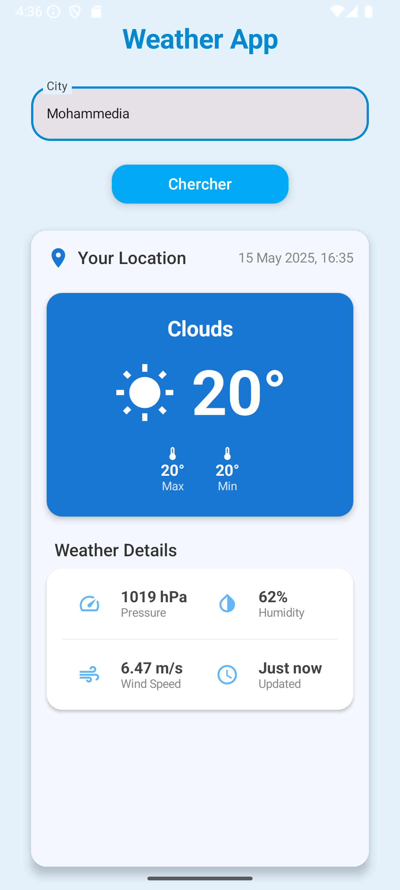

# Weather App

Une application météo simple développée avec **Jetpack Compose** et **Volley**. Elle permet de rechercher la météo actuelle d'une ville en utilisant l’API d’[OpenWeatherMap](https://openweathermap.org/api).

## Fonctionnalités

* Recherche météo par nom de ville
* Affichage de :

    * La température actuelle
    * La condition météo (ex. : nuageux, ensoleillé)
    * Les températures maximale et minimale
    * La pression atmosphérique
    * L'humidité
    * La vitesse du vent
    * L’heure de la dernière mise à jour
* Interface moderne avec Jetpack Compose

## API utilisée

**Endpoint :**
`https://api.openweathermap.org/data/2.5/weather?q={city}&appid={API_KEY}`

## Screenshots

